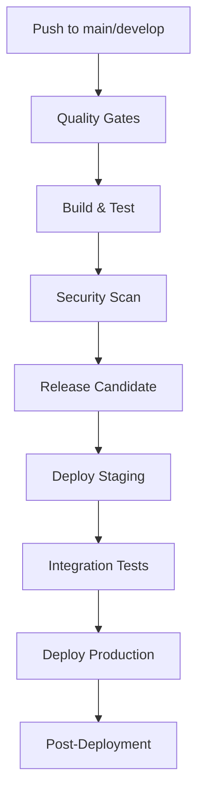

# Nimble Tools

A comprehensive character creation and management application for the Nimble 2 RPG system. This Progressive Web App (PWA) provides an intuitive interface for creating and managing RPG characters with full offline functionality.

## 🏗️ Technology Stack

### Frontend Framework
- **React 19.1.1** - Modern React with latest features and hooks
- **TypeScript 5.9.2** - Type-safe development with full IntelliSense support
- **Vite 7.1.2** - Fast build tool and development server

### Styling & UI
- **Tailwind CSS 4.1.12** - Utility-first CSS framework
- **PostCSS 8.5.6** - CSS processing and optimization
- **Custom Design System** - Medieval/fantasy themed UI with responsive design

### Development Tools
- **ESLint 9.33.0** - Code linting and quality enforcement
- **Prettier 3.6.2** - Code formatting with Tailwind plugin
- **Vitest 3.2.4** - Fast unit testing framework
- **Playwright 1.55.0** - End-to-end testing
- **Testing Library** - React component testing utilities

### Data & Storage
- **IndexedDB** - Client-side database for offline data persistence
- **Custom Storage Services** - Type-safe data management layer

### Build & Deployment
- **Vite PWA Plugin 1.0.3** - Progressive Web App functionality
- **Autoprefixer 10.4.21** - CSS vendor prefixing

## ✨ Features

### Character Management
- **Complete Character Creation** - Step-by-step guided character creation process
- **Character Storage** - Persistent local storage with IndexedDB
- **Character Overview** - Detailed character cards with stats and information
- **Character Deletion** - Safe character removal with confirmation
- **Auto-Navigation** - Automatic navigation to Characters page on app load
- **Smart Deletion** - Characters with empty names can be deleted without confirmation for quick cleanup

### Character Creation Process
1. **Choose Class** - Select from available character classes:
   - **The Berserker** - Damage-dealing machine with high HP (20) and d12 hit dice
   - **The Cheat** - Rule-breaking specialist with d6 hit dice and sneaky abilities
   - **The Commander** - Tactical leader with d10 hit dice and strategic advantages
   - **The Hunter** - Wilderness expert with d8 hit dice and deadly precision
2. **Choose Ancestry** - Select character ancestry/background
3. **Choose Background** - Select character background/profession
4. **Assign Stats** - Distribute ability points (Strength, Dexterity, Intelligence, Will)
5. **Assign Skills** - Allocate skill points based on class and background
6. **Character Details** - Set name, age, height, weight, and other details

### Technical Features
- **Progressive Web App (PWA)** - Installable on mobile and desktop
- **Offline First** - Full functionality without internet connection
- **Responsive Design** - Optimized for mobile, tablet, and desktop
- **State Persistence** - Remembers user progress and settings
- **Type Safety** - Full TypeScript coverage with runtime validation
- **Modern UI/UX** - Smooth animations and intuitive navigation

## 🚀 Getting Started

### Prerequisites
- **Node.js** (version 18 or higher)
- **npm** or **yarn** package manager

### Quick Start

1. **Clone the repository**
   ```bash
   git clone <repository-url>
   cd nimble-tools
   ```

2. **Install dependencies**
   ```bash
   npm install
   ```

3. **Start the development server**
   ```bash
   npm run dev
   ```

4. **Open your browser**
   Navigate to `http://localhost:5173` (or the port shown in your terminal)

### First Time Setup
The application will automatically:
- Set up the development environment
- Install PWA service worker for offline functionality
- Initialize local storage for character data
- Navigate to the Characters page automatically (single-button optimization)

## 🛠️ Development

### Available Scripts

| Script | Description |
|--------|-------------|
| `npm run dev` | Start development server with hot reload |
| `npm run build` | Build production-ready application |
| `npm run preview` | Preview production build locally |
| `npm run lint` | Run ESLint for code quality checks |
| `npm run test` | Run unit tests with Vitest |
| `npm run test:e2e` | Run end-to-end tests with Playwright |

### Development Workflow

1. **Make Changes** - Edit files in the `src/` directory
2. **Check Code Quality** - Run `npm run lint` to ensure code standards
3. **Test Changes** - Run `npm run test` for unit tests
4. **Build & Test** - Run `npm run build` to verify production build

### Project Structure

```
src/
├── App.tsx                 # Main application component
├── main.tsx               # Application entry point
├── index.css              # Global styles and Tailwind imports
├── features/
│   └── characters/        # Character management feature
│       ├── components/    # React components
│       │   ├── CharactersPage.tsx
│       │   ├── CharacterCreationPage.tsx
│       │   └── characterCreation/  # Creation workflow components
│       ├── data/          # Static data files
│       ├── models/        # TypeScript interfaces and types
│       └── services/      # Data access and business logic
├── shared/                # Shared utilities and constants
└── assets/                # Static assets (images, icons)
```

### Key Components

- **App.tsx** - Main application router and layout
- **CharactersPage.tsx** - Character list and management
- **CharacterCreationPage.tsx** - Multi-step character creation wizard
- **Character Storage Service** - IndexedDB data persistence
- **Data Loaders** - Static data management for classes, ancestries, etc.

## 🧪 Testing

### Unit Tests
Run unit tests with:
```bash
npm run test
```

### End-to-End Tests
Run E2E tests with:
```bash
npm run test:e2e
```

### Test Coverage
- Component rendering and interactions
- Data persistence and retrieval
- Form validation and error handling
- PWA functionality and offline behavior

## 📱 Progressive Web App (PWA)

This application is a fully functional PWA that can be:
- **Installed** on mobile devices and desktop
- **Used Offline** with full functionality
- **Updated Automatically** when new versions are available

### Installation
1. Open the app in a supported browser (Chrome, Edge, Safari)
2. Click "Install" or "Add to Home Screen"
3. The app will be available as a native application

## 🚀 Deployment

### Build for Production
```bash
npm run build
```

This creates an optimized production build in the `dist/` directory.

### Deployment Options
- **GitHub Pages** - Free hosting directly from your repository (recommended)
- **Static Hosting** - Deploy to Netlify, Vercel, or other platforms
- **CDN** - Serve static files from any CDN
- **Self-hosted** - Deploy to any web server
- **Docker** - Containerized deployment with included Dockerfile

### Environment Variables
No environment variables are required for basic functionality. All configuration is handled at build time.

## 🔄 CI/CD Pipeline

This project includes a comprehensive CI/CD pipeline using GitHub Actions that automates the entire release process.

### Pipeline Features

#### **Automated Release Candidates**
- **Version Management**: Automatic semantic versioning based on conventional commits
- **Release Candidate Generation**: Creates `v1.2.3-rc.N` tags with build numbers
- **Changelog Generation**: Automatic changelog creation using conventional commits
- **Artifact Packaging**: Optimized builds with PWA assets and deployment packages

#### **Quality Gates**
- **Code Quality**: ESLint, Prettier, TypeScript type checking
- **Unit Tests**: Vitest with coverage reporting
- **E2E Tests**: Playwright tests across multiple browsers and devices
- **Security Scanning**: Dependency vulnerability checks and code security analysis
- **Performance**: Bundle size monitoring and Lighthouse scores

#### **Multi-Environment Deployment**
- **Staging**: Automated deployment from `main` branch
- **Production**: Manual approval required for releases
- **Integration Tests**: Automated testing against staging environment
- **Health Checks**: Post-deployment verification

### Pipeline Stages



### GitHub Actions Workflow

The CI/CD pipeline is defined in `.github/workflows/ci-cd.yml` and includes:

1. **Quality Assurance Job**
   - Code linting and formatting checks
   - TypeScript type checking
   - Unit test execution with coverage
   - Codecov integration

2. **Build & Test Job**
   - Production build creation
   - E2E test execution
   - Build artifact generation
   - Test result archiving

3. **Security Scan Job**
   - Dependency vulnerability scanning
   - Code security analysis
   - Container security (if applicable)

4. **Release Candidate Generation**
   - Automatic version bumping
   - Changelog generation
   - GitHub release creation
   - Artifact packaging

5. **Deployment Jobs**
   - Staging environment deployment
   - Integration testing
   - Production deployment
   - Health check verification

### Release Process

#### **Automatic Release Candidates**
1. Push to `main` branch triggers the pipeline
2. All quality gates must pass
3. Version is automatically incremented
4. Release candidate is created with format `v1.2.3-rc.N`
5. Changelog is generated from commit messages
6. Artifacts are packaged and stored

#### **Production Releases**
1. Review release candidate in GitHub Releases
2. Test staging deployment
3. Manually approve production deployment
4. Production deployment with rollback capability
5. Post-deployment monitoring and alerting

### Deployment Configurations

#### **Static Hosting (Recommended)**
```yaml
# Example: Netlify deployment
- name: Deploy to Netlify
  uses: nwtgck/actions-netlify@v2.0
  with:
    publish-dir: './dist'
    production-branch: main
  env:
    NETLIFY_AUTH_TOKEN: ${{ secrets.NETLIFY_AUTH_TOKEN }}
    NETLIFY_SITE_ID: ${{ secrets.NETLIFY_SITE_ID }}
```

#### **Docker Deployment**
```yaml
# Build and push Docker image
- name: Build and push Docker image
  uses: docker/build-push-action@v5
  with:
    context: .
    push: true
    tags: myregistry.com/nimble-tools:${{ github.sha }}
```

### Configuration Files

- **`.github/workflows/ci-cd.yml`** - Main CI/CD pipeline definition
- **`playwright.staging.config.ts`** - E2E test configuration for staging
- **`Dockerfile`** - Multi-stage Docker build for containerized deployment
- **`nginx.conf`** - Production nginx configuration with PWA support
- **`scripts/deploy.sh`** - Deployment script for different environments
- **`scripts/health-check.sh`** - Post-deployment health verification

### Required Secrets

Set these in your GitHub repository settings:

```bash
# For GitHub Pages deployment (automatically provided)
GITHUB_TOKEN=github_pat_with_repo_permissions

# For staging/production URLs (optional - for health checks)
STAGING_URL=https://your-username.github.io/your-repo-name
PRODUCTION_URL=https://your-username.github.io/your-repo-name

# For Docker registry (if using containerized deployment)
DOCKER_USERNAME
DOCKER_PASSWORD
```

### Monitoring and Alerting

- **Pipeline Monitoring**: Success/failure notifications via Slack/Discord
- **Performance Monitoring**: Bundle size and Lighthouse score tracking
- **Error Tracking**: Application error monitoring (integrate with Sentry, LogRocket)
- **Uptime Monitoring**: Health check endpoints for deployed applications

### Cost Optimization

- **GitHub Actions**: 2,000 free minutes/month
- **Caching**: Dependencies and build artifacts are cached
- **Parallel Execution**: Tests run in parallel to reduce execution time
- **Artifact Cleanup**: Old artifacts are automatically cleaned up

### Troubleshooting

#### **Common Issues**
- **Pipeline Fails**: Check GitHub Actions logs for detailed error messages
- **Test Failures**: Review test screenshots and videos in artifacts
- **Deployment Issues**: Check deployment logs and health check results
- **Version Conflicts**: Ensure conventional commit format for proper versioning

#### **Debugging Steps**
1. Check the Actions tab in GitHub for pipeline status
2. Review job logs for error details
3. Download artifacts for test results and build outputs
4. Check deployment status and health check results
5. Review release notes and changelog for version information

## 🤝 Contributing

1. **Fork the repository**
2. **Create a feature branch** (`git checkout -b feature/amazing-feature`)
3. **Make your changes** and ensure tests pass
4. **Commit your changes** (`git commit -m 'Add amazing feature'`)
5. **Push to the branch** (`git push origin feature/amazing-feature`)
6. **Open a Pull Request**

### Code Standards
- Follow TypeScript best practices
- Use functional React components with hooks
- Maintain test coverage for new features
- Follow existing code formatting (Prettier)
- Use meaningful commit messages

## 📄 License

This project is licensed under the MIT License - see the LICENSE file for details.

## 🆘 Support

If you encounter any issues or have questions:
1. Check the existing issues on GitHub
2. Create a new issue with detailed information
3. Include browser version, device type, and steps to reproduce

## 🎯 Roadmap

- [ ] Additional character classes
- [ ] Character advancement system
- [ ] Campaign management
- [ ] Character import/export
- [ ] Theme customization
- [ ] Multi-language support