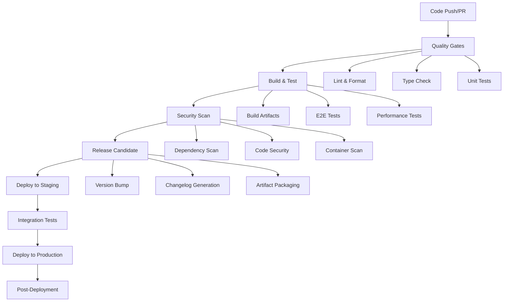

# CI/CD Pipeline Plan for Nimble Tools Application

## Project Overview

**Application**: Nimble Tools - A collection of tools for the Nimble 2 RPG system
**Tech Stack**:
- Frontend: React 19.1.1 with TypeScript
- Build Tool: Vite 7.1.2
- Testing: Vitest (unit tests) + Playwright (E2E tests)
- Styling: Tailwind CSS 4.1.12
- PWA: Vite PWA plugin
- Quality: ESLint, Prettier, Husky (Git hooks)

## CI/CD Pipeline Architecture

### Pipeline Stages



## GitHub Actions Workflow Configuration

### Main CI/CD Workflow (`.github/workflows/ci-cd.yml`)

```yaml
name: CI/CD Pipeline

on:
  push:
    branches: [ main, develop ]
  pull_request:
    branches: [ main, develop ]
  release:
    types: [ published ]

env:
  NODE_VERSION: '20'
  CACHE_KEY: 'nimble-tools-${{ runner.os }}-node-${{ env.NODE_VERSION }}'

jobs:
  # Quality Assurance Job
  quality:
    name: Quality Assurance
    runs-on: ubuntu-latest
    steps:
      - name: Checkout code
        uses: actions/checkout@v4

      - name: Setup Node.js
        uses: actions/setup-node@v4
        with:
          node-version: ${{ env.NODE_VERSION }}
          cache: 'npm'
          cache-dependency-path: package-lock.json

      - name: Install dependencies
        run: npm ci

      - name: Lint code
        run: npm run lint

      - name: Type check
        run: npx tsc --noEmit

      - name: Format check
        run: npx prettier --check .

      - name: Unit tests
        run: npm test -- --coverage --watchAll=false

      - name: Upload coverage
        uses: codecov/codecov-action@v3
        with:
          file: ./coverage/lcov.info

  # Build and Test Job
  build-test:
    name: Build & Test
    runs-on: ubuntu-latest
    needs: quality
    steps:
      - name: Checkout code
        uses: actions/checkout@v4

      - name: Setup Node.js
        uses: actions/setup-node@v4
        with:
          node-version: ${{ env.NODE_VERSION }}
          cache: 'npm'

      - name: Install dependencies
        run: npm ci

      - name: Build application
        run: npm run build

      - name: Install Playwright browsers
        run: npx playwright install --with-deps

      - name: Run E2E tests
        run: npm run test:e2e
        env:
          CI: true

      - name: Upload build artifacts
        uses: actions/upload-artifact@v4
        with:
          name: build-artifacts
          path: dist/
          retention-days: 30

      - name: Upload test results
        uses: actions/upload-artifact@v4
        with:
          name: test-results
          path: |
            test-results/
            playwright-report/
          retention-days: 30

  # Security Scan Job
  security:
    name: Security Scan
    runs-on: ubuntu-latest
    needs: build-test
    steps:
      - name: Checkout code
        uses: actions/checkout@v4

      - name: Setup Node.js
        uses: actions/setup-node@v4
        with:
          node-version: ${{ env.NODE_VERSION }}

      - name: Install dependencies
        run: npm ci

      - name: Audit dependencies
        run: npm audit --audit-level moderate

      - name: Run security scan
        uses: github/super-linter/slim@v5
        env:
          DEFAULT_BRANCH: main
          GITHUB_TOKEN: ${{ secrets.GITHUB_TOKEN }}
          VALIDATE_JAVASCRIPT_ES: true
          VALIDATE_TYPESCRIPT_ES: true
          VALIDATE_JSON: true

      - name: Dependency vulnerability scan
        uses: dependency-check/Dependency-Check_Action@main
        with:
          project: 'Nimble Tools'
          path: '.'
          format: 'ALL'

  # Release Candidate Generation
  release-candidate:
    name: Generate Release Candidate
    runs-on: ubuntu-latest
    needs: [quality, build-test, security]
    if: github.ref == 'refs/heads/main' && github.event_name == 'push'
    outputs:
      version: ${{ steps.version.outputs.version }}
      tag: ${{ steps.version.outputs.tag }}
    steps:
      - name: Checkout code
        uses: actions/checkout@v4
        with:
          fetch-depth: 0

      - name: Setup Node.js
        uses: actions/setup-node@v4
        with:
          node-version: ${{ env.NODE_VERSION }}

      - name: Install dependencies
        run: npm ci

      - name: Download build artifacts
        uses: actions/download-artifact@v4
        with:
          name: build-artifacts
          path: dist/

      - name: Generate version and changelog
        id: version
        run: |
          # Get current version from package.json
          CURRENT_VERSION=$(node -p "require('./package.json').version")

          # Generate new version (patch increment for RC)
          NEW_VERSION=$(node -e "
            const version = '$CURRENT_VERSION'.split('.');
            version[2] = parseInt(version[2]) + 1;
            console.log(version.join('.'));
          ")

          # Create RC tag
          RC_TAG="v${NEW_VERSION}-rc.${GITHUB_RUN_NUMBER}"

          echo "version=$NEW_VERSION" >> $GITHUB_OUTPUT
          echo "tag=$RC_TAG" >> $GITHUB_OUTPUT

          # Update package.json with new version
          npm version $NEW_VERSION --no-git-tag-version

      - name: Generate changelog
        run: |
          npx conventional-changelog -p angular -i CHANGELOG.md -s -r 0
          echo "# Release Candidate ${{ steps.version.outputs.tag }}" >> temp_changelog.md
          echo "" >> temp_changelog.md
          cat CHANGELOG.md >> temp_changelog.md
          mv temp_changelog.md CHANGELOG.md

      - name: Create release candidate
        uses: actions/create-release@v1
        env:
          GITHUB_TOKEN: ${{ secrets.GITHUB_TOKEN }}
        with:
          tag_name: ${{ steps.version.outputs.tag }}
          release_name: Release Candidate ${{ steps.version.outputs.tag }}
          body_path: CHANGELOG.md
          draft: true
          prerelease: true

      - name: Upload release artifacts
        uses: actions/upload-artifact@v4
        with:
          name: release-candidate
          path: |
            dist/
            CHANGELOG.md
            package.json
          retention-days: 60

  # Deploy to Staging
  deploy-staging:
    name: Deploy to Staging
    runs-on: ubuntu-latest
    needs: release-candidate
    if: github.ref == 'refs/heads/main' && github.event_name == 'push'
    environment: staging
    steps:
      - name: Download release artifacts
        uses: actions/download-artifact@v4
        with:
          name: release-candidate
          path: ./artifacts

      - name: Deploy to staging
        run: |
          echo "Deploying ${{ needs.release-candidate.outputs.tag }} to staging"
          # Add your staging deployment commands here
          # Example: rsync, scp, cloud deployment, etc.

      - name: Health check
        run: |
          # Add health check for staging deployment
          echo "Performing health check on staging environment"

  # Integration Tests
  integration-test:
    name: Integration Tests
    runs-on: ubuntu-latest
    needs: deploy-staging
    if: github.ref == 'refs/heads/main' && github.event_name == 'push'
    steps:
      - name: Checkout code
        uses: actions/checkout@v4

      - name: Setup Node.js
        uses: actions/setup-node@v4
        with:
          node-version: ${{ env.NODE_VERSION }}

      - name: Install dependencies
        run: npm ci

      - name: Install Playwright browsers
        run: npx playwright install --with-deps

      - name: Run integration tests
        run: |
          # Run tests against staging environment
          npx playwright test e2e/ --config=playwright.staging.config.ts
        env:
          BASE_URL: ${{ secrets.STAGING_URL }}
          CI: true

  # Production Deployment
  deploy-production:
    name: Deploy to Production
    runs-on: ubuntu-latest
    needs: integration-test
    if: github.ref == 'refs/heads/main' && github.event_name == 'push'
    environment: production
    steps:
      - name: Download release artifacts
        uses: actions/download-artifact@v4
        with:
          name: release-candidate
          path: ./artifacts

      - name: Deploy to production
        run: |
          echo "Deploying ${{ needs.release-candidate.outputs.tag }} to production"
          # Add your production deployment commands here

      - name: Health check
        run: |
          # Add health check for production deployment
          echo "Performing health check on production environment"

      - name: Create production release
        uses: actions/create-release@v1
        env:
          GITHUB_TOKEN: ${{ secrets.GITHUB_TOKEN }}
        with:
          tag_name: ${{ needs.release-candidate.outputs.version }}
          release_name: Production Release ${{ needs.release-candidate.outputs.version }}
          body_path: artifacts/CHANGELOG.md
          draft: false
          prerelease: false

  # Post-deployment monitoring
  post-deployment:
    name: Post-Deployment Monitoring
    runs-on: ubuntu-latest
    needs: deploy-production
    if: always()
    steps:
      - name: Monitor deployment
        run: |
          # Add monitoring and alerting logic
          echo "Monitoring post-deployment metrics"

      - name: Send notifications
        if: failure()
        run: |
          # Send failure notifications
          echo "Sending deployment failure notifications"

      - name: Send notifications
        if: success()
        run: |
          # Send success notifications
          echo "Sending deployment success notifications"
```

## Release Candidate Generation Strategy

### Version Management

1. **Semantic Versioning**: Follows SemVer (MAJOR.MINOR.PATCH)
2. **Pre-release Tags**: Release candidates use format `v1.2.3-rc.N`
3. **Automatic Version Bump**: Based on conventional commits

### Release Process

1. **Trigger**: Push to `main` branch
2. **Version Calculation**:
   - Analyze commit messages for version bump type
   - Generate new version number
   - Create RC tag with build number

3. **Artifacts Generation**:
   - Build optimized production bundle
   - Generate source maps
   - Create PWA assets
   - Package for deployment

4. **Quality Gates**:
   - All tests pass (unit + E2E)
   - Security scans pass
   - Code coverage meets threshold
   - Build artifacts validated

## Deployment Strategy

### Environments

1. **Development**: Local development with hot reload
2. **Staging**: Automated deployment from `main` branch
3. **Production**: Manual approval required for releases

### Deployment Methods

#### Option 1: Static Hosting (Recommended)
```yaml
# Deploy to Netlify/Vercel/Cloudflare Pages
- name: Deploy to Netlify
  uses: nwtgck/actions-netlify@v2.0
  with:
    publish-dir: './dist'
    production-branch: main
    github-token: ${{ secrets.GITHUB_TOKEN }}
    deploy-message: "Deploy from GitHub Actions"
  env:
    NETLIFY_AUTH_TOKEN: ${{ secrets.NETLIFY_AUTH_TOKEN }}
    NETLIFY_SITE_ID: ${{ secrets.NETLIFY_SITE_ID }}
```

#### Option 2: Cloud Storage + CDN
```yaml
# Deploy to AWS S3 + CloudFront
- name: Deploy to S3
  uses: jakejarvis/s3-sync-action@v0.5.1
  with:
    args: --acl public-read --follow-symlinks --delete
  env:
    AWS_S3_BUCKET: ${{ secrets.AWS_S3_BUCKET }}
    AWS_ACCESS_KEY_ID: ${{ secrets.AWS_ACCESS_KEY_ID }}
    AWS_SECRET_ACCESS_KEY: ${{ secrets.AWS_SECRET_ACCESS_KEY }}
    SOURCE_DIR: 'dist'
```

#### Option 3: Docker + Kubernetes
```yaml
# Build and push Docker image
- name: Build and push Docker image
  uses: docker/build-push-action@v5
  with:
    context: .
    push: true
    tags: |
      myregistry.com/nimble-tools:${{ github.sha }}
      myregistry.com/nimble-tools:${{ needs.release-candidate.outputs.tag }}
```

## Quality Gates and Security

### Code Quality
- **ESLint**: JavaScript/TypeScript linting
- **Prettier**: Code formatting
- **TypeScript**: Type checking
- **Test Coverage**: Minimum 80% coverage required

### Security Measures
- **Dependency Audit**: npm audit for vulnerabilities
- **Code Security**: GitHub CodeQL analysis
- **Container Security**: Trivy scans for Docker images
- **Secrets Management**: GitHub Secrets for sensitive data

### Performance Monitoring
- **Bundle Size**: Monitor JavaScript bundle size
- **Lighthouse**: Automated performance testing
- **PWA Score**: Progressive Web App compliance

## Monitoring and Alerting

### Application Monitoring
```yaml
# Add to production deployment
- name: Setup monitoring
  run: |
    # Configure error tracking (Sentry, LogRocket, etc.)
    # Setup performance monitoring
    # Configure uptime monitoring
```

### Pipeline Monitoring
- **Success/Failure Notifications**: Slack/Discord webhooks
- **Metrics Collection**: Pipeline duration, success rates
- **Alerting**: Failed deployments, security vulnerabilities

## Rollback Strategy

### Automated Rollback
```yaml
# Add to production deployment job
- name: Rollback on failure
  if: failure()
  run: |
    # Rollback to previous version
    # Notify team
    # Update monitoring dashboards
```

### Manual Rollback
1. Identify the last stable release
2. Deploy previous version
3. Update release tags
4. Communicate with stakeholders

## Branching Strategy

### Git Flow
```
main (production) ──┐
                    ├── release/v1.2.3
develop ───────────┘
    ├── feature/authentication
    ├── feature/character-builder
    └── bugfix/login-validation
```

### Release Branching
- `main`: Production releases
- `develop`: Integration branch
- `release/*`: Release preparation
- `hotfix/*`: Production hotfixes

## Configuration Files

### Additional Configuration Files Needed

1. **Playwright Staging Config** (`playwright.staging.config.ts`):
```typescript
import { defineConfig } from '@playwright/test';

export default defineConfig({
  use: {
    baseURL: process.env.STAGING_URL,
  },
  // Staging-specific test configuration
});
```

2. **Dockerfile** (if using containerized deployment):
```dockerfile
FROM node:20-alpine AS builder
WORKDIR /app
COPY package*.json ./
RUN npm ci --only=production

FROM nginx:alpine
COPY --from=builder /app/dist /usr/share/nginx/html
COPY nginx.conf /etc/nginx/nginx.conf
EXPOSE 80
CMD ["nginx", "-g", "daemon off;"]
```

3. **nginx.conf** (for production serving):
```nginx
server {
    listen 80;
    server_name localhost;
    root /usr/share/nginx/html;
    index index.html;

    location / {
        try_files $uri $uri/ /index.html;
    }

    # Cache static assets
    location ~* \.(js|css|png|jpg|jpeg|gif|ico|svg)$ {
        expires 1y;
        add_header Cache-Control "public, immutable";
    }

    # Security headers
    add_header X-Frame-Options "SAMEORIGIN" always;
    add_header X-Content-Type-Options "nosniff" always;
    add_header X-XSS-Protection "1; mode=block" always;
}
```

## Implementation Checklist

### Phase 1: Basic CI/CD
- [ ] Create GitHub Actions workflow file
- [ ] Configure Node.js setup and caching
- [ ] Implement linting and type checking
- [ ] Add unit test execution
- [ ] Configure build process

### Phase 2: Testing & Quality
- [ ] Add E2E test execution
- [ ] Configure test reporting
- [ ] Implement code coverage
- [ ] Add security scanning
- [ ] Configure performance monitoring

### Phase 3: Release Management
- [ ] Implement version management
- [ ] Add changelog generation
- [ ] Configure release candidate creation
- [ ] Set up artifact management

### Phase 4: Deployment
- [ ] Choose deployment platform
- [ ] Configure staging environment
- [ ] Implement production deployment
- [ ] Add health checks and monitoring

### Phase 5: Advanced Features
- [ ] Implement rollback strategy
- [ ] Add integration testing
- [ ] Configure alerting and notifications
- [ ] Set up performance monitoring

## Cost Optimization

### GitHub Actions Minutes
- **Free Tier**: 2,000 minutes/month
- **Paid Tier**: $0.008/minute for additional minutes
- **Optimization Strategies**:
  - Use caching for dependencies
  - Run tests in parallel
  - Use smaller runner images
  - Skip unnecessary jobs for certain triggers

### Storage Costs
- **Artifacts**: $0.25/GB for storage over 500MB
- **Logs**: Retained for 90 days
- **Optimization**: Clean up old artifacts regularly

## Maintenance and Updates

### Regular Tasks
- [ ] Update Node.js version quarterly
- [ ] Review and update dependencies monthly
- [ ] Monitor pipeline performance
- [ ] Update security scanning rules
- [ ] Review and optimize costs

### Emergency Procedures
- [ ] Pipeline failure response
- [ ] Security incident handling
- [ ] Rollback procedures
- [ ] Communication protocols

This CI/CD pipeline plan provides a comprehensive, production-ready solution for the Nimble Tools application with automated release candidate generation, multi-environment deployment, and robust quality gates.